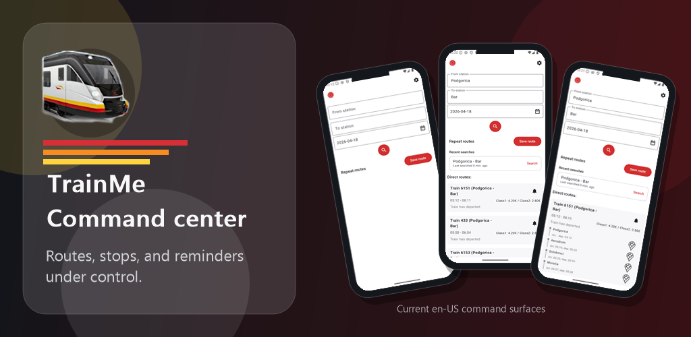
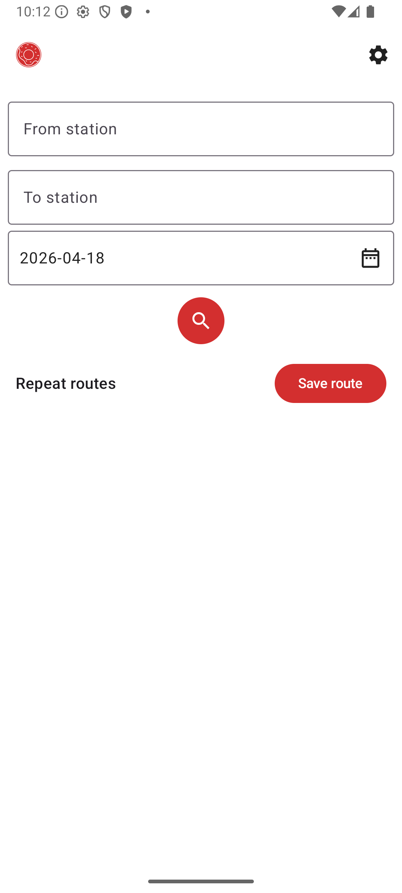
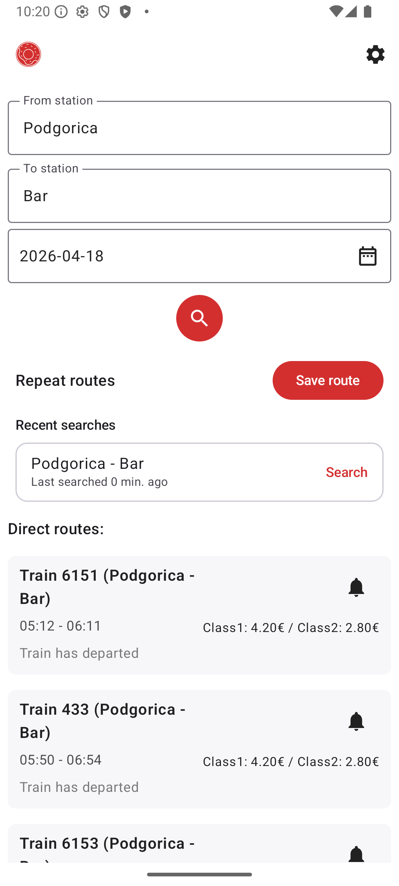
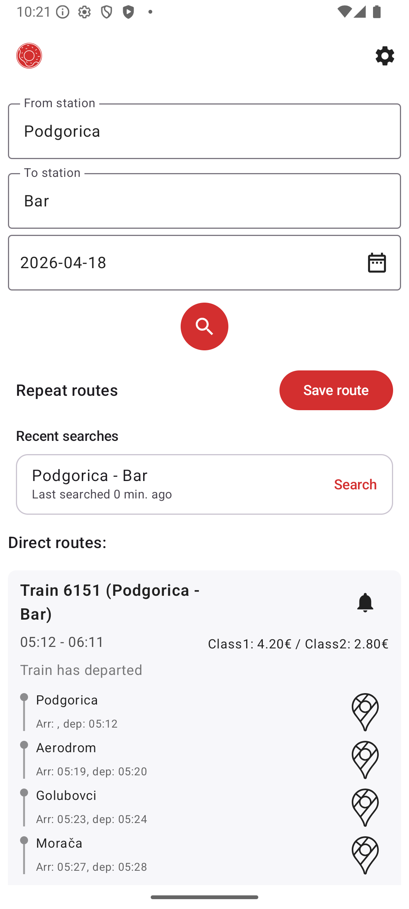
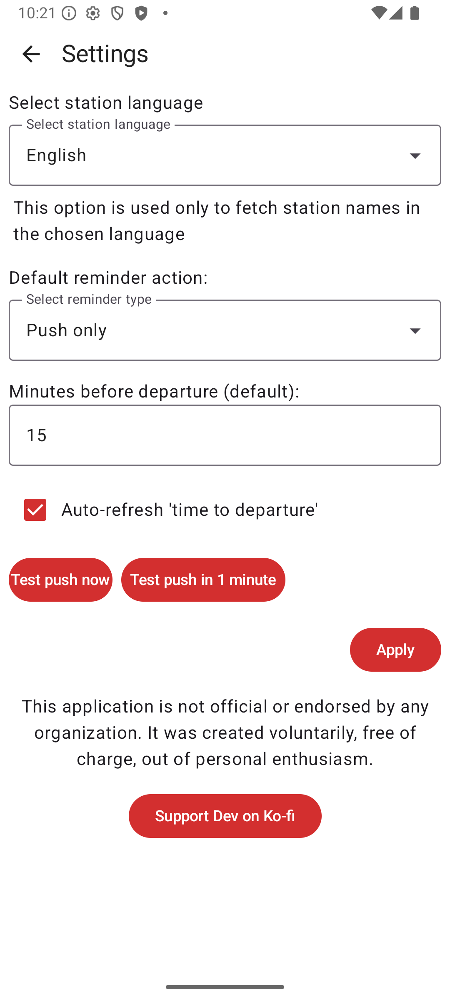
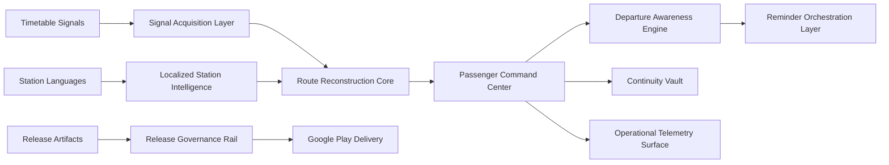

# TrainMe

<!-- public-repo-status -->
> Status: Active Android app. Public installation is through Google Play; GitHub Releases are not used as an Android download channel.

**Passenger Operations Command Center for Montenegro rail journeys.**

TrainMe turns timetable uncertainty into an operational surface: localized station intelligence, route reconstruction, departure awareness, reminder orchestration, and release-governed Android delivery.

[](https://play.google.com/store/apps/details?id=com.queukat.train)


<p align="center">
  
</p>

## Install

**Google Play release:** https://play.google.com/store/apps/details?id=com.queukat.train

## Visual Command Surface

<table>
  <tr>
    <td width="25%" align="center">
      
    </td>
    <td width="25%" align="center">
      
    </td>
    <td width="25%" align="center">
      
    </td>
    <td width="25%" align="center">
      
    </td>
  </tr>
  <tr>
    <td align="center"><strong>Command Center</strong></td>
    <td align="center"><strong>Route Reconstruction</strong></td>
    <td align="center"><strong>Stop Intelligence</strong></td>
    <td align="center"><strong>Governance Surface</strong></td>
  </tr>
</table>

## Independence Notice

TrainMe is an independent passenger-facing system. It is **not** the official timetable, ticketing product, or service channel of **ZPCG AD Podgorica** (Zeljeznicki prevoz Crne Gore).

For official schedules, tickets, service notices, and company information, use the official ZPCG website:

https://www.zpcg.me

## Public Positioning

TrainMe should be presented as a serious product system, not as a loose list of screens or technical tasks. Every public capability should explain what disorder it detects, what control it introduces, and what visible result the passenger receives.

The repository keeps the full rule in [docs/presentation_style.md](docs/presentation_style.md).

## System Overview

Rail planning is not a search box. It is a stack of disorder:

- station names appear across languages and writing systems
- timetable services can return stale, missing, or unreachable signals
- direct and connected journeys compete for attention
- departure time keeps moving after the passenger chooses a route
- Android reminder permissions differ across devices and OS versions
- release delivery needs signed artifacts, changelog discipline, and store validation

TrainMe organizes those moving parts into named control layers.

## System Map



## Capability Domains

| Capability | Disorder It Detects | Control It Introduces | Passenger-Visible Result |
| --- | --- | --- | --- |
| **Signal Acquisition Layer** | Remote timetable and station signals may be unavailable or inconsistent. | Retrofit-backed acquisition with structured repository handling. | Route search has a stable entry point instead of scattered network behavior. |
| **Localized Station Intelligence** | Station names shift between English, Montenegrin Latin, and Montenegrin Cyrillic. | Language-aware station catalogs with local persistence. | Passengers search in the station language that matches their context. |
| **Route Reconstruction Core** | Raw timetable responses do not naturally read as decisions. | Direct and connected journeys are shaped into route cards, travel time, price signals, and full-route views. | The passenger sees review-ready travel options instead of raw schedule fragments. |
| **Transfer Clarity Surface** | Intermediate stops and transfer segments can hide the real journey shape. | Full-route expansion and stop-state labels expose the path. | Passengers understand what happens between origin and destination. |
| **Departure Awareness Engine** | A chosen departure becomes less useful as time passes. | Time-to-departure calculation and optional auto-refresh keep the route state current. | The journey card remains operational after the first search. |
| **Reminder Orchestration Layer** | Calendar flow, push notifications, exact alarms, and Android permissions can conflict. | A governed reminder path supports push, calendar, both, or no reminder. | The passenger receives a clear reminder outcome and visible failure reasons. |
| **Continuity Vault** | Repeated journeys and recent searches disappear unless the system remembers them. | Favorites, repeat routes, and recent searches preserve intent across sessions. | Commuter patterns become one-tap starting points. |
| **Operational Telemetry Surface** | Network errors, cached data, update state, and permission failures can feel invisible. | Status banners, notification channels, and update messaging expose operational state. | The passenger sees what the system knows and what needs attention. |
| **Release Governance Rail** | Store delivery can drift through unsigned bundles, missing changelogs, or accidental package targeting. | Play release commands enforce signing checks, package targeting, changelog staging, and validation before upload. | Public releases ship through a controlled delivery path. |

## Architecture

| Layer | Role |
| --- | --- |
| **Jetpack Compose Command Center** | Main passenger surface for station selection, date control, route review, reminders, and settings. |
| **ViewModel Orchestration Layer** | Coordinates user intent, loading state, cached signals, route results, and reminder outcomes. |
| **Repository Signal Pipeline** | Shields the UI from remote service details and converts acquisition results into domain decisions. |
| **Room Continuity Store** | Persists station intelligence, favorites, recent searches, and route continuity data. |
| **Android Reminder Rail** | Uses AlarmManager, BroadcastReceiver, notification channels, and calendar intents where the device allows it. |
| **Release Governance Rail** | Builds, verifies, signs, validates, and publishes Android artifacts through the documented Play path. |

```text
app/src/main/java/com/queukat/train/
|- data/api/          Signal Acquisition Gateway
|- data/db/           Room Continuity Store
|- data/model/        Timetable Signal Contracts
|- data/repository/   Route Reconstruction Pipeline
|- ui/                Passenger Command Center
|- util/              Reminder, Locale, Time, and Update Rails
```

## Operational Surfaces

**Main Command Center**

- Origin and destination station control
- Date selection for a specific travel window
- Direct and connected route surfaces
- Favorite and repeat-route continuity
- Reminder entry point from the route card

**Route Intelligence Surface**

- Travel time
- Price signals
- Departure and arrival windows
- Full-route expansion
- Intermediate stop state
- Map handoff when coordinates are available

**Settings Governance Surface**

- Station language policy
- Default reminder action
- Reminder lead time
- Auto-refresh policy
- Notification verification path

## Developer Entry Points

Clone and open the Android workspace:

```powershell
git clone https://github.com/queukat/TrainApp.git TrainMe
cd TrainMe
```

Build the debug artifact:

```powershell
.\gradlew.bat :app:assembleDebug
```

Install on a connected device or emulator:

```powershell
.\gradlew.bat :app:installDebug
```

Run focused unit tests:

```powershell
.\gradlew.bat :app:testDebugUnitTest
```

## Build Profile

- Android package: `com.queukat.train`
- Min SDK: 24
- Target SDK: 35
- Compile SDK: 36
- Java: 17
- Kotlin: 2.1.10
- Android Gradle Plugin: 8.9.3
- UI: Jetpack Compose with Material 3
- Persistence: Room
- Network: Retrofit and OkHttp

For signing and Play delivery, use [docs/release_setup.md](docs/release_setup.md) and [docs/play_release.md](docs/play_release.md).

## Release Governance

The Play delivery path is intentionally governed. Production releases should pass through the private release rail or CI path that implements the checks documented in [docs/release_setup.md](docs/release_setup.md) and [docs/play_release.md](docs/play_release.md).

That path should build or accept the artifact, verify signing, target the expected package, stage localized changelogs, validate against Play, and upload only when publishing is explicitly requested.

## Contribution Standard

Contributions should preserve the system language:

- name capabilities by the layer of disorder they control
- describe user-visible order before implementation mechanics
- keep official-affiliation language precise and conservative
- keep release notes public-facing and free of internal jargon
- avoid adding unsupported scale, partnership, revenue, or guarantee claims

Typical contribution flow:

```powershell
git checkout -b capability/<name>
git commit -m "Strengthen <capability>"
git push origin capability/<name>
```

## License

<!-- commercial-license-policy -->
This project is licensed for non-commercial use under the [PolyForm Noncommercial License 1.0.0](https://polyformproject.org/licenses/noncommercial/1.0.0.txt).
Commercial use, resale, paid distribution, marketplace publication, SaaS hosting, or bundling into a paid product requires separate written permission from the author.
Project names, logos, package identifiers, store listings, screenshots, and other branding assets are not licensed for use in forks or redistributed builds.
