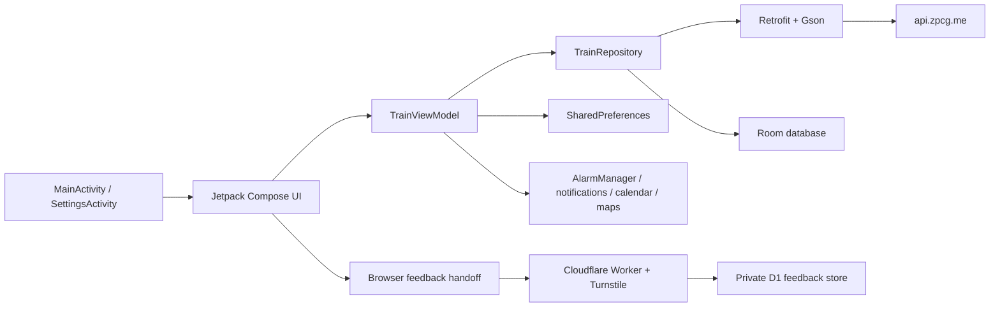

# TrainMe Architecture

_Last reviewed: 2026-08-19_

TrainMe is a single-module Android application for planning passenger rail journeys in Montenegro. It is independent from ZPCG AD Podgorica and does not implement ticket sales, accounts, payments, live train tracking, or an official service channel.

## Runtime topology

`MainActivity` manually composes `AppDatabase`, `TrainRepository`, and `TrainViewModel`. There is no dependency-injection container or separate use-case/domain module. The ViewModel owns passenger intent and UI state; the repository owns remote acquisition, cache refresh, and response enrichment.

## Component responsibilities

| Component | Responsibility | Important boundary |
| --- | --- | --- |
| `MainActivity` | Applies launch extras and locale, creates the notification channel, builds the main dependency graph, and starts stop loading or an initial route request. | Exported launcher activity; launch extras are convenience inputs, not an authenticated integration API. |
| `SettingsActivity` | Persists station-language, reminder, lead-time, and countdown-refresh preferences. | Recreates the main activity after saved settings change. |
| Compose `ui/` | Search controls, direct/connected cards, full-route dialog, saved/recent routes, reminders, settings, and status banners. | Reads ViewModel state; presentation mapping is partly in the UI package. |
| `TrainViewModel` | Coordinates stops, route lookup, timeout/error state, full-route details, reminders, saved routes, recents, and countdown refresh. | Uses `StateFlow`; saved/recent continuity is stored in preferences, not Room. |
| `TrainRepository` | Fetches stops/routes/cumulative data, manages cache freshness, enriches responses with local coordinates, and distinguishes transport failures. | Uses Retrofit responses and Room entities directly; there is no separate domain model layer. |
| `data/api` | Declares the remote timetable contract and Retrofit client. | Base URL is `https://api.zpcg.me/`. |
| `data/db` | Stores station catalogue and route metadata in Room. | Database schema version is 1 and currently permits destructive migration. |
| `util/` | Timezone parsing, notifications, exact alarms, calendar/maps handoff, dispatchers, and locale overrides. | Reminder delivery depends on Android permissions and device policy. |

## Main data flows

### Station catalogue

1. The ViewModel exposes cached Room stops when available.
2. The repository refreshes when the database is empty, refresh is forced, or `stops_last_update` is older than roughly 24 hours.
3. Successful results upsert the returned local station rows; rows omitted by the latest response are not explicitly cleared.
4. If refresh fails but cached stops exist, the UI keeps the cache and shows a warning. If no catalogue exists, the UI shows an error.

Station suggestions match English, Montenegrin Latin, and Montenegrin Cyrillic names. The selected station must resolve to a known `StopEntity`; free text alone is not a valid route endpoint.

### Route lookup

1. The UI provides selected origin, destination, and travel date.
2. The ViewModel converts the selected stops to API route names and applies a 10-second request timeout.
3. `TrainRepository` calls `api/routes` and enriches returned routes with cached endpoint data and coordinates.
4. UI presentation maps the repository result to results, empty state, station-selection error, network error, server error, or invalid-response error.

The API model contains direct routes plus connected routes grouped by interchange. Connected journey cards present two legs; reminder actions apply to the first departure leg.

### Cumulative-route reconstruction (not currently exposed)

The repository and ViewModel contain a cumulative-route reconstruction path using `api/routes/cumulative`, but the current UI has no call site that starts `loadFullRoute()`. If that path is wired in future, the raw cumulative response is cached only in process memory for roughly 12 hours; a cache miss or process restart requires a new network request. The lookup searches direct services and both connected segments by timetable identifier.

The Room `route_info` table and its repository update function exist, but no active runtime caller currently populates that path. It must not be described as a persistent full-route cache.

### Saved routes and recent searches

Saved routes and recent searches use `train_prefs`:

- `saved_routes_v2`: saved route records held as a JSON-backed string set;
- legacy `saved_routes`: migrated when the station catalogue is available;
- `recent_searches_v1`: JSON array, deduplicated and capped at five entries.

Repeating a saved or recent journey resolves the current station records and starts a new search. These records are not Room entities.

### Reminder orchestration

The passenger may choose an on-device notification reminder, calendar handoff, both, or none.

- Notification reminders use `AlarmManager`, an internal `BroadcastReceiver`, and an immutable `PendingIntent`.
- Android 13+ notification permission and Android S+ exact-alarm access may be required.
- Reminders that are already too close or in the past are rejected with a visible outcome.
- Calendar support opens an `ACTION_INSERT` draft in another app; TrainMe does not write directly to a calendar provider.
- Scheduled reminders are not restored after device reboot because no boot receiver/rescheduling path exists.

### Departure countdown

When `autoRefreshTime` is enabled, the main Compose surface refreshes time-to-departure values approximately once per minute. Train times are interpreted in `Europe/Podgorica`, with `Europe/Belgrade` as fallback.

### Feedback handoff

Settings builds an HTTPS feedback URL from the current Android interface locale, app version, and Android version, then opens it through a browser intent. Station-display language, saved routes, and recent searches are not included.

The same-origin Worker serves the six-locale static form and accepts only validated JSON submissions. Turnstile is loaded after local form validation; the Worker verifies its result against the exact production hostname and `feedback` action before a prepared D1 insert. Text and optional contact are available only through a bounded maintainer query. The public Shields route exposes only the aggregate number of rows awaiting review, cached for five minutes. A scheduled handler deletes rows around 180 days after creation.

## External contracts

| Contract | Shape |
| --- | --- |
| Stops | `GET api/stops` |
| Routes | `GET api/routes?start=<origin-route-name>&finish=<destination-route-name>&date=<yyyy-MM-dd>` |
| Cumulative routes | `GET api/routes/cumulative` |
| Timetable datetime | Strict `yyyy-MM-dd HH:mm:ss` in the Montenegro timezone |
| Connected response | Map keyed by interchange; an empty array is tolerated as an empty map |
| Feedback form | `https://trainme-feedback.queukat.workers.dev` with `lang`, `app_version`, and `android_version` query metadata |

The application depends on the remote timetable service for fresh catalogue and journey data. Repository code cannot establish the service operator’s uptime, logging, retention, or accuracy guarantees.

## Persistence and cache matrix

| Data | Storage | Lifetime / refresh | Notes |
| --- | --- | --- | --- |
| Station catalogue | Room `stops` | Refresh after roughly 24 hours | Cached data can remain usable during a network failure. |
| Route metadata | Room `route_info` | No active population path | Present in schema but not an active full-route cache. |
| Cumulative response | Process memory | Roughly 12 hours | Lost on process death. |
| Saved routes | SharedPreferences | Until app data is cleared | JSON-backed records with legacy migration. |
| Recent searches | SharedPreferences | Until app data is cleared; maximum five | Stores endpoints and search timestamp. |
| Settings | SharedPreferences | Until app data is cleared | Language, reminder defaults, lead time, and countdown refresh. |

Room uses `fallbackToDestructiveMigration(dropAllTables = true)`. Before increasing the schema version, add an explicit data-preserving migration; otherwise cached Room tables can be dropped during upgrade. SharedPreferences continuity is outside that Room migration path.

## Build facts

- Module: `:app`
- Namespace and application ID: `com.queukat.train`
- Minimum SDK: 24
- Target and compile SDK: 36
- Java/Kotlin JVM target: 17
- Kotlin: 2.1.10
- Android Gradle Plugin: 8.9.3
- Gradle wrapper: 8.13

## Known limitations

- No persistent full-route/cumulative cache.
- No boot-time reminder restoration.
- No direct unit coverage for the repository’s network/cache orchestration or real Room migrations.
- Saved/recent route records use ordinary private preferences rather than application-level encryption.
- Certificate validation uses Android system trust without certificate pinning.
- Several instrumented flows depend on the live timetable API and may skip when it is unavailable.
- The current Room migration fallback is destructive and must not be treated as a data-preservation guarantee.
